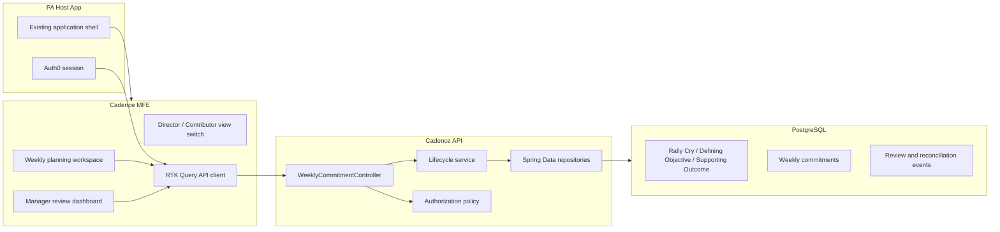
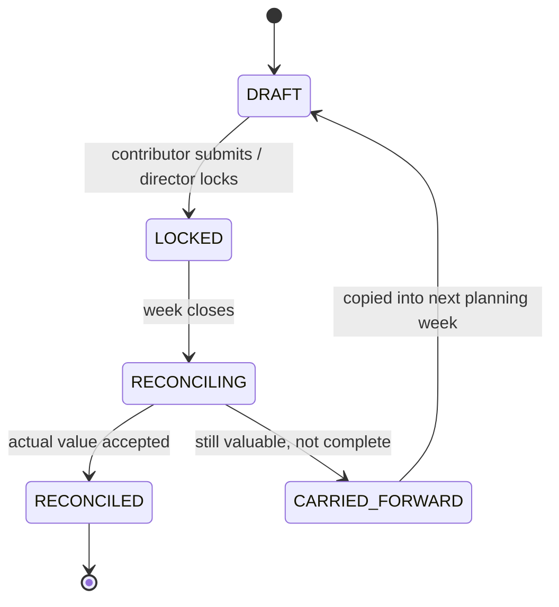

# Cadence Architecture

Cadence is a weekly execution system for ST6 Partners. The product replaces disconnected 15Five-style weekly plans with a workflow where commitments, manager review, reconciliation, and carry-forward decisions are all tied to the RCDO hierarchy.

The important idea is simple: a weekly commitment is not accepted unless it points to a Supporting Outcome. That makes weekly execution visible at the same level where strategy is already managed.

## Target Product Shape

Cadence has two primary views.

- Director view: team alignment, risk triage, weekly state controls, manager review, and RCDO coverage.
- Contributor view: personal weekly commitments, RCDO-linked creation, execution notes, reconciliation, and carry-forward requests.

Both views use the same data model. The difference is permission, scope, and default workflow.

Current repository reality: the React remote now has a local Contributor/Director workspace toggle with alpha planning, reconciliation, roll-up, and review surfaces. It is still not permission-backed by Auth0 or the PA host, and several workflow paths use local fallback behavior when remote endpoints are unavailable.

## Current Repository State

The repository currently proves the following pieces.

- React 18 micro-frontend remote under `apps/wc`.
- Vite Module Federation remote named `cadence`, exposing `./CadenceApp`.
- RTK Query API layer for current week, create/update commitment, lock, reconciliation, review, and manager dashboard calls.
- React UI for current commitments, RCDO links, lifecycle status, chess layer, confidence, Contributor create/reconcile, and Director roll-up/review.
- Static Director/Contributor render options with working view toggles.
- Spring Boot 3.3 backend under `backend`.
- PostgreSQL/Flyway schema for RCDO hierarchy, weekly commitments, and workflow metadata.
- `WeeklyCommitmentWorkflow` service for commitment-level lifecycle rules and carry-forward creation.
- Auth0 resource-server shape on the backend.
- Audited JPA entities.
- Unit, E2E, backend, coverage, Spotless, and SpotBugs checks.

The repository does not yet prove the whole product workflow. The largest missing slice is real end-to-end weekly operations: create, assign, lock, reconcile, review, carry forward, and explain the alignment impact inside the production React remote with backend-enforced rules.

## Target System



## Weekly Lifecycle

The lifecycle should be enforced by backend transition rules, not only by frontend button visibility.



### State Responsibilities

- `DRAFT`: contributor can create, edit, delete, and link commitments.
- `LOCKED`: commitment becomes the weekly contract; edits require manager override or a new note.
- `RECONCILING`: contributor records actual value, completion state, blockers, and carry-forward request.
- `RECONCILED`: manager accepts actuals and closes the record.
- `CARRIED_FORWARD`: unfinished work is intentionally moved into the next week with context.

## Domain Model

Core entities:

- `RallyCry`: top-level strategic focus.
- `DefiningObjective`: objective under a Rally Cry.
- `SupportingOutcome`: concrete outcome under a Defining Objective.
- `WeeklyCommitment`: the unit of weekly work.
- `ReviewEvent`: proposed next entity for manager comments, approvals, overrides, and audit history.
- `WorkflowTransition`: proposed next entity for explicit lifecycle audit.

Key `WeeklyCommitment` fields:

- `ownerUserId`
- `ownerName`
- `managerUserId`
- `title`
- `plannedValue`
- `actualValue`
- `status`
- `chessLayer`
- `supportingOutcomeId`
- `dueDate`
- `confidence`
- `blockerReason`
- `carryForwardReason`

## View Contracts

### Director View

The Director view should answer these questions quickly.

- Which commitments are linked to the current Rally Cry?
- Which outcomes are undercovered or overcommitted?
- Which people are blocked?
- Which work is high leverage but low confidence?
- Which reconciliation records need review?
- What should be carried forward, canceled, or escalated?

Primary interactions:

- Lock team week.
- Review individual plans.
- Reassign or request clarification.
- Approve reconciliation.
- Carry forward work into next week.
- Filter by RCDO, person, chess layer, status, and confidence.

### Contributor View

The Contributor view should make planning fast but disciplined.

- Create a weekly commitment.
- Pick the Supporting Outcome from the hierarchy.
- Choose chess layer and expected value.
- Lock the plan.
- Reconcile actual value at week end.
- Request carry-forward with reason.

Primary interactions:

- Add commitment.
- Edit draft.
- Attach RCDO link.
- Submit weekly plan.
- Record actual outcome.
- Explain blockers.

## API Surface

Current endpoints:

- `GET /api/weekly-commitments/current`
- `GET /api/weekly-commitments`
- `GET /api/weekly-commitments/{id}`
- `POST /api/weekly-commitments`
- `PUT /api/weekly-commitments/{id}`
- `DELETE /api/weekly-commitments/{id}`
- `POST /api/weekly-commitments/{id}/lock`
- `POST /api/weekly-commitments/{id}/transition`
- `POST /api/weekly-commitments/{id}/review`
- `POST /api/weekly-commitments/{id}/reconciliation/start`
- `PUT /api/weekly-commitments/{id}/reconciliation`
- `POST /api/weekly-commitments/{id}/carry-forward`
- `GET /api/manager-dashboard/commitments`

Recommended next endpoints:

- `GET /api/rcdo/tree`
- `POST /api/weeks/{weekId}/lock` or equivalent week-level lock endpoint.
- Explicit review/transition event history endpoint once audit moves beyond row metadata.
- Frontend API hook cleanup so lock/review paths and status types line up with the current backend controller.

Recommended transition request:

```json
{
  "targetStatus": "RECONCILED",
  "actualValue": "Partner onboarding checklist adopted by 4 portfolio companies",
  "reviewNote": "Accepted. Strong signal for repeatable operating cadence."
}
```

## Frontend Architecture

The production frontend should keep the micro-frontend boundary small.

- Remote app owns Cadence routes and state.
- Host app owns shell, navigation, and authenticated session.
- RTK Query owns server cache and invalidation.
- Component state owns only local form state and table filters.
- View mode is a first-class UI state: `director` or `contributor`.

Recommended component split:

- `CadenceApp`
- `ViewModeToggle`
- `DirectorDashboard`
- `ContributorWorkspace`
- `CommitmentForm`
- `RcdoPicker`
- `LifecycleRail`
- `CommitmentTable`
- `ReconciliationPanel`
- `ReviewQueue`

Current delta: the main component split exists inside `apps/wc/src/app/app.tsx`, not as separately owned modules. Some newer RTK Query hooks describe intended lock/review behavior but still need path and status alignment with the current backend workflow.

## Backend Architecture

The backend should separate transport, policy, and workflow.

- Controller: request/response mapping.
- Service: lifecycle transitions and business rules.
- Policy: user scope and permissions.
- Repository: persistence.
- Mapper: entity/DTO transformation.

The lifecycle service is the most important backend proof because it prevents the frontend from inventing invalid states.

Example rules:

- A commitment cannot lock without a Supporting Outcome.
- A locked commitment cannot be deleted by a contributor.
- Reconciliation cannot happen before lock.
- Carry-forward requires an actual value or blocker reason.
- Director can override state with an audit event.

Current delta: `WeeklyCommitmentWorkflow` now owns commitment-level create, update, delete, lock, review, reconciliation, transition, and carry-forward rules. It is a real step toward backend enforcement, but authorization is still a lightweight actor helper, review/transition audit history is stored as row metadata instead of an event stream, and there is no week-level lock aggregate yet.

## Authorization Model

Auth0 should provide identity. Cadence should interpret identity into scope.

- Contributor can read and write own draft commitments.
- Contributor can reconcile own locked commitments.
- Director can read team commitments.
- Director can lock team week and approve reconciliation.
- Admin can maintain RCDO hierarchy.

The current backend has structural Auth0 wiring. A demo mode can use permit-all locally, but production must keep JWT validation and user-derived ownership.

## Performance Model

PRD targets:

- Plan retrieval under 200ms.
- Sub-second initial route render.
- CDN-delivered remote bundle.
- Pageable manager views up to 2000 records.

Technical choices:

- RTK Query deduplicates requests and centralizes invalidation.
- Pageable backend endpoints prevent large team payloads.
- RCDO tree can be cached aggressively because it changes less often than commitments.
- Manager dashboard should request summary metrics separately from paged records.
- Remote bundle should split heavy dashboard and reconciliation surfaces.

## PRD Coverage Snapshot

| PRD area                 | Current status    | Honest read                                                                                                                                                                        |
| ------------------------ | ----------------- | ---------------------------------------------------------------------------------------------------------------------------------------------------------------------------------- |
| Module Federation remote | Covered           | Vite 5 remote exposes `./CadenceApp` and builds `remoteEntry.js`. It still needs PA host smoke testing.                                                                            |
| RCDO-linked commitments  | Partially covered | Schema, seed data, DTOs, table display, and create payload require a Supporting Outcome. There is no full RCDO picker endpoint yet.                                                |
| Director workflow        | Partially covered | React remote has a Director mode with team roll-up, lock button, and manager review surface. It is not permission-backed and the full backend contract is not aligned yet.         |
| Contributor workflow     | Partially covered | React remote has a Contributor mode with create/edit fields and reconciliation queue. It still needs real RCDO picker data, production validation, and real-backend E2E proof.     |
| Lifecycle enforcement    | Partially covered | `WeeklyCommitmentWorkflow` enforces commitment-level transitions and carry-forward creation. Week-level locking, event audit history, and frontend lifecycle UX are still missing. |
| Manager dashboard scale  | Partially covered | Pageable backend endpoint exists. There is no production UX or realistic 2000-record performance proof.                                                                            |
| Auth0 and authorization  | Scaffolded        | JWT resource-server wiring exists. ST6 tenant integration and user-scope policies are not proven.                                                                                  |
| Outlook/Microsoft Graph  | Not covered       | No code path exists.                                                                                                                                                               |
| Demo proof               | Partially covered | Docs, static renders, and focused Playwright coverage exist. No demo video or host-app walkthrough exists.                                                                         |

## Technical Proof Points

Previously proven locally:

- Frontend tests pass.
- Frontend typecheck passes.
- Frontend build emits the remote.
- Backend tests pass.
- Maven verify, Spotless, SpotBugs, and JaCoCo run.

Current May 31 proof:

- Chromium E2E passes and now covers the real Contributor/Director toggle plus create, reconciliation, and manager review paths with mocked API responses.
- Chromium E2E also covers the static Director/Contributor timeline toggle and contributor reconciliation form visibility.

Backend note: `./mvnw test` was not completed in this pass because the default shell could not locate a Java runtime. Rerun with the documented Java 21 environment before claiming current backend proof.

Commands:

```bash
yarn test
yarn typecheck
yarn build
yarn e2e

cd backend
./mvnw test
./mvnw verify spotless:check spotbugs:check
```

Proof still needed:

- Permission-backed Director/Contributor flow inside `apps/wc`.
- Browser proof through the full create/edit/lock/reconcile/review loop against the real backend.
- Lifecycle transition tests around every valid and invalid state change in `WeeklyCommitmentWorkflow`.
- Backend pagination test with realistic manager data volume.
- Auth0 tenant integration or a documented local substitute.
- Host app smoke test if ST6 provides the host shell.

## Demo Stories

These are manufactured but plausible stories for showing business impact. In an interview or demo, describe them as target workflow stories backed by the current scaffold and static renders, not as fully shipped production behavior.

### Story 1: Portfolio Operating Review

Director Mira owns the Rally Cry "Raise portfolio operating velocity." On Monday, her team enters 42 commitments. Cadence shows that 36 are linked to the Rally Cry, 4 are linked to lower-priority hiring outcomes, and 2 are unlinked. Mira asks for clarification before lock, preventing a week of misaligned work.

Business impact: alignment issues are caught before execution, not during Friday review.

### Story 2: Hiring Bottleneck

Contributor Nikolay creates a Queen-layer commitment to reconcile hiring commitments across portfolio companies. By Wednesday, confidence drops from 74% to 48% because two owners have not supplied status. The Director view surfaces it as high-leverage, low-confidence work, so Mira reassigns support and keeps the hiring plan moving.

Business impact: manager intervention happens midweek while the outcome is still recoverable.

### Story 3: Carry-Forward Discipline

Contributor Amara misses a board-readiness commitment because legal review blocks a dependency. Cadence requires actual value and carry-forward reason. The Director accepts the carry-forward, links it to the same Supporting Outcome, and preserves the blocker note for next week.

Business impact: unfinished work is not silently copied forward. It carries context, owner, and strategic reason.

## Render Options

Three static render directions are included under `docs/render-options`.

- `option-1-operating-room.html`: dense operating dashboard for weekly triage.
- `option-2-workflow-timeline.html`: lifecycle-first view that makes state progression obvious.
- `option-3-executive-ledger.html`: table-led control surface for data-heavy review.

Each option includes:

- Director/Contributor toggle.
- RCDO-linked commitments.
- Lifecycle stages.
- Manager review and contributor reconciliation surfaces.
- Technical proof panel.
- Demo stories with business impact.

These render options are useful for demo storytelling and product direction. They are not wired to the React remote or backend API.

## How to Explain Technical Prowess

Lead with the architecture choices, then name the gaps before the interviewer has to ask.

- Micro-frontend boundary: Cadence is packaged as a Vite Module Federation remote so ST6 can mount it inside the PA host without forcing a host rewrite.
- Data contract: weekly commitments point at Supporting Outcomes, so product behavior is tied to the Rally Cry -> Defining Objective -> Supporting Outcome hierarchy instead of loose text updates.
- Frontend state: RTK Query owns server cache, invalidation, and API boundaries; React component state stays limited to form and view concerns.
- Backend shape: Spring Boot, Flyway, JPA auditing, pageable endpoints, `WeeklyCommitmentWorkflow`, and resource-server wiring give the prototype a production-shaped spine.
- Risk control: the docs are explicit that frontend role split, week-level lifecycle controls, richer authorization policy, event audit history, host integration, and Graph integration remain unfinished.
- Demo proof: show the current app for the real Contributor/Director alpha workflow, then show the static timeline as the strongest product-direction reference and explain which code slice would harden it into production.

## Honest Product Gaps

The current scaffold is technically credible, but it is not yet a finished weekly planning product.

The next best build slice is:

1. Harden the existing Contributor/Director React workflow behind permission-backed view scope.
2. Add an RCDO tree picker backed by `GET /api/rcdo/tree`.
3. Harden `WeeklyCommitmentWorkflow` with direct service tests for valid and invalid transitions.
4. Add week-level lock behavior and separate transition/review audit history.
5. Align Contributor reconciliation and Director review UI with the final backend contract.
6. Add tests for lifecycle rules, authorization scope, manager dashboard behavior, and host-app mounting.

That slice would turn the scaffold from "architecture proof" into "usable demo alpha."
