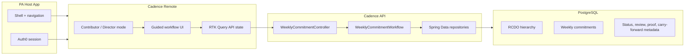
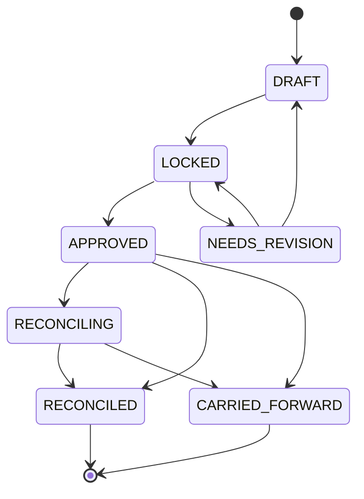

# Cadence Architecture

Cadence is a weekly execution system. Its job is to make the connection between weekly work and strategic intent impossible to miss.

Every commitment must point to a Supporting Outcome in the RCDO hierarchy:

`Rally Cry -> Defining Objective -> Supporting Outcome -> Weekly Commitment`

That is the core architectural decision. Everything else exists to support that constraint with a usable workflow.

## Product Intent

Cadence replaces loose 15Five-style planning with a guided weekly loop:

1. Contributor chooses the strategic outcome.
2. Contributor shapes the weekly commitment.
3. Director reviews alignment and risk.
4. Work is locked for the week.
5. Contributor reconciles planned value against actual value.
6. Director accepts, requests revision, or carries valuable unfinished work forward.

The UX should feel guided and immediate. The user should not have to decode the system. The best mental model is a configuration flow with instant feedback: as the user chooses an outcome, layer, owner, and value, Cadence should show what that decision does to the week.

## Where It Fits

Cadence is designed to mount inside an existing PA host app.

- The host owns app shell, navigation, route mounting, and authenticated session.
- Cadence owns weekly planning, RCDO-linked commitments, lifecycle actions, and manager review.
- The backend owns lifecycle validity and persistence.

## Current Implementation

### Frontend

- React 18 app in `apps/wc`.
- Vite Module Federation remote named `cadence`.
- Exposes `./CadenceApp`.
- RTK Query owns all API calls.
- Tailwind and Flowbite provide the current UI system.
- Contributor/Director mode is local UI state.
- Contributor surface includes create/edit fields and reconciliation.
- Director surface includes team roll-up, lock action, and review decisions.
- Fixture fallback keeps the alpha usable when the backend is unavailable.

### Backend

- Spring Boot 3.3, Java 21.
- PostgreSQL with Flyway migrations.
- JPA entities extend `AbstractAuditingEntity`.
- `WeeklyCommitmentWorkflow` owns business rules.
- `WeeklyCommitmentController` exposes the HTTP API.
- Auth0 resource-server wiring exists, with local permit-all mode for demos.
- JaCoCo, Spotless, and SpotBugs are configured and passing.

### Data

Current persisted model:

- `rally_cries`
- `defining_objectives`
- `supporting_outcomes`
- `weekly_commitments`

`weekly_commitments` stores:

- owner identity and display name
- title and planned value
- actual value and proof
- status
- chess layer
- week start and due date
- confidence
- manager identity and review note
- lock, review, and reconciliation timestamps
- carry-forward source link

This is enough for a credible alpha. The production version should split review and transition history into append-only event records.

## Lifecycle

The backend enforces commitment-level lifecycle transitions. The current model adds `APPROVED` and `NEEDS_REVISION` as explicit manager review states so Director review is more than a comment.

State responsibilities:

- `DRAFT`: contributor can create, edit, delete, and link to RCDO.
- `LOCKED`: weekly intent is frozen for Director review.
- `APPROVED`: Director accepts the commitment for execution.
- `NEEDS_REVISION`: Director asks contributor to adjust the plan.
- `RECONCILING`: contributor records actual value.
- `RECONCILED`: commitment is closed with actual value.
- `CARRIED_FORWARD`: original is closed and a next-week draft is created with the same RCDO link.

## API Surface

Implemented endpoints:

- `GET /api/weekly-commitments/current`
- `GET /api/weekly-commitments`
- `GET /api/weekly-commitments/{id}`
- `POST /api/weekly-commitments`
- `PUT /api/weekly-commitments/{id}`
- `DELETE /api/weekly-commitments/{id}`
- `POST /api/weekly-commitments/{id}/lock`
- `POST /api/weekly-commitments/current/lock`
- `POST /api/weekly-commitments/{id}/transition`
- `POST /api/weekly-commitments/{id}/review`
- `PUT /api/manager-dashboard/commitments/{id}/review`
- `POST /api/weekly-commitments/{id}/reconciliation/start`
- `PUT /api/weekly-commitments/{id}/reconciliation`
- `POST /api/weekly-commitments/{id}/carry-forward`
- `GET /api/manager-dashboard/commitments`

Recommended next endpoints:

- `GET /api/rcdo/tree`
- `GET /api/weeks/current/summary`
- `POST /api/weeks/{weekId}/lock`
- `GET /api/weekly-commitments/{id}/events`

The next API step is week-level orchestration. Current lock behavior is useful for alpha testing, but a production weekly module should treat the week as an aggregate with summary, lock, close, and review windows.

## Frontend State Model

RTK Query is the API boundary. It owns:

- current week
- manager dashboard page
- create commitment
- update commitment
- lock week
- update reconciliation
- review commitment

React component state owns:

- current visible mode
- local form values
- local reconciliation drafts
- local review drafts
- alpha fallback notices

This separation is intentional. Server state should not be copied into random component state except where the alpha needs optimistic or fallback behavior.

## UX Architecture

The mounted-host experience should be action-led.

Contributor landing goal:

- Show one primary action: create or finish this week's commitment.
- Present RCDO selection first because it is the strategic anchor.
- Let the user shape the commitment with minimal fields.
- Show immediate alignment feedback.
- Reconciliation should ask for actual value and carry-forward only when relevant.

Director landing goal:

- Show what needs attention first.
- Surface undercovered outcomes, blocked work, low confidence, and review queue.
- Make lock, approve, request revision, and carry-forward decisions obvious.
- Keep tables for scanning, not for primary creation.

The desired feeling is guided configuration with visible impact. The product should avoid unnecessary button presses, nested forms, or ambiguous status management.

## Technical Choices

- **Module Federation** keeps Cadence independently deployable while fitting into the PA host.
- **React** supports a rich, responsive workflow without bringing in a heavier app framework.
- **RTK Query** keeps fetch, loading, error, and invalidation behavior consistent.
- **Spring Boot** provides a clear service/controller/repository split and enterprise-friendly test/tooling support.
- **PostgreSQL** fits the relational execution model.
- **Flyway** makes schema evolution explicit.
- **JPA auditing** gives baseline created/updated metadata.
- **JaCoCo, Spotless, SpotBugs** keep backend quality measurable.
- **Playwright** proves the user workflow, not just isolated components.

## Proof

Verified locally on May 31, 2026:

- `yarn typecheck`
- `yarn test`
- `yarn build`
- `yarn e2e`
- `./mvnw test`
- `./mvnw verify spotless:check spotbugs:check`

E2E covers:

- real React Contributor/Director toggle
- create commitment with mocked API response
- reconciliation with carry-forward
- Director review decision
- static render-option toggle and reconciliation controls

Backend tests cover:

- lifecycle service happy path
- invalid transitions
- manager-only review
- carry-forward creation
- revision update
- controller endpoints and error mapping
- JaCoCo 80% gate

## Honest Gaps

These are product gaps, not speculative extras.

- Host integration still needs proof in the artificial host.
- Role selection must become permission-backed when host/Auth0 context is available.
- The current UI is functional but still too table/form-led for the desired guided experience.
- RCDO tree should come from the backend instead of static frontend options.
- Week-level lock and close should become first-class aggregate operations.
- Transition/review history should become append-only events.
- Manager dashboard needs realistic scale testing.
- Microsoft Graph/Outlook scope is still undefined and unimplemented.

## Next Build Slice

Once the artificial host is mounted, the highest-value slice is UX polish around the real workflow:

1. Make the landing state show one obvious next action.
2. Turn commitment creation into a guided, low-friction flow.
3. Add immediate visual feedback for RCDO alignment and Director risk.
4. Reduce table-first interactions for Contributor mode.
5. Keep Director review dense but prioritize attention and decisions.
6. Wire the guided actions to the existing backend lifecycle endpoints.

That work would make the demo feel like a product, not a checklist.
